# API Project

## Set up docker databases
Please ensure you have docker running.
Change directory into the project folder, here you will see a docker-compose.yml file.
Run the following command to create postgres databases for the project
```bash
docker-compose up
```

## Running the project
You can either load the project in IntelliJ Idea and click the run/play icon located in the toolbar or if you have Java 21 installed
you can run the below maven command to start the project and run the liquibase scripts.
```bash
./mvnw spring-boot:run
```

## Running JUnit tests
You can either load the project in IntelliJ Idea and run the tests or if you have Java 21 installed
you can run the below maven command to run the tests.
```bash
./mvnw test
```

## HTTP Basic Authentication 
The API has been configured for HTTP Basic Authentication you will need to provide a username and password on each request to the API.
The username and password can be found in the application.properties file of the project. If you are using Postman for testing you can enter
these credentials on the 'Authorization' tab of the request.

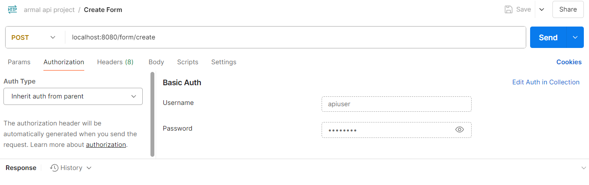


## Creating a Form
To create an Application form you will need to send a POST request to the below endpoint
```text
http://localhost:8080/form/create
```
The server will produce a response status of 201 Created and a body containing a numeric form id as shown
below. Please make note of your numeric form id as you will need this on future requests

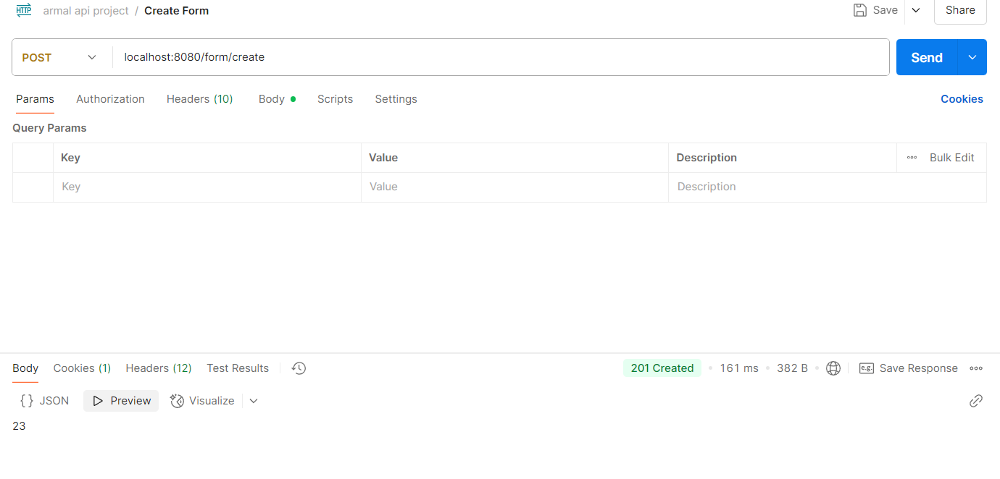


## Submitting Personal details
To associate Personal details to the form you will need to send a POST request along with a JSON payload
of the personal details you would like to save. Please note you will need to provide the form id 
retrieved when you initially created the form.

```text
http://localhost:8080/form/save/personal-details
```
The server will produce a response status of 201 Created and provide a URI in the response headers 'Location' property. 
You can use this URI to make a GET request for the personal details resource we saved.
just created
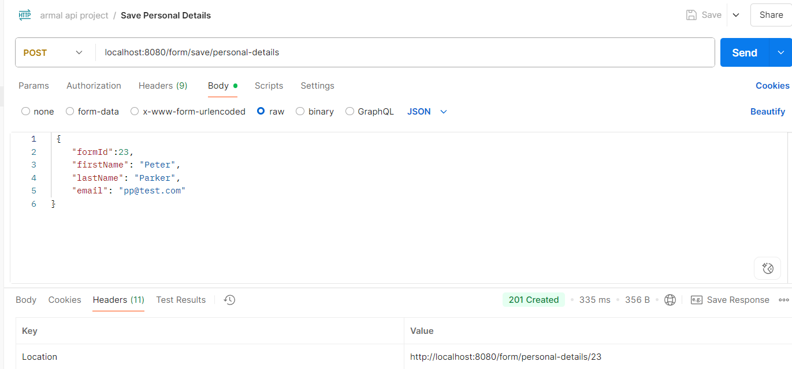

## Viewing the Personal detials
Using the returned URI from the previous response we are able to submit a GET request to view the resource. The server will return a 
response status 200 OK and a JSON payload containing the personal details of the form
```text
http://localhost:8080/form/personal-details/23
```
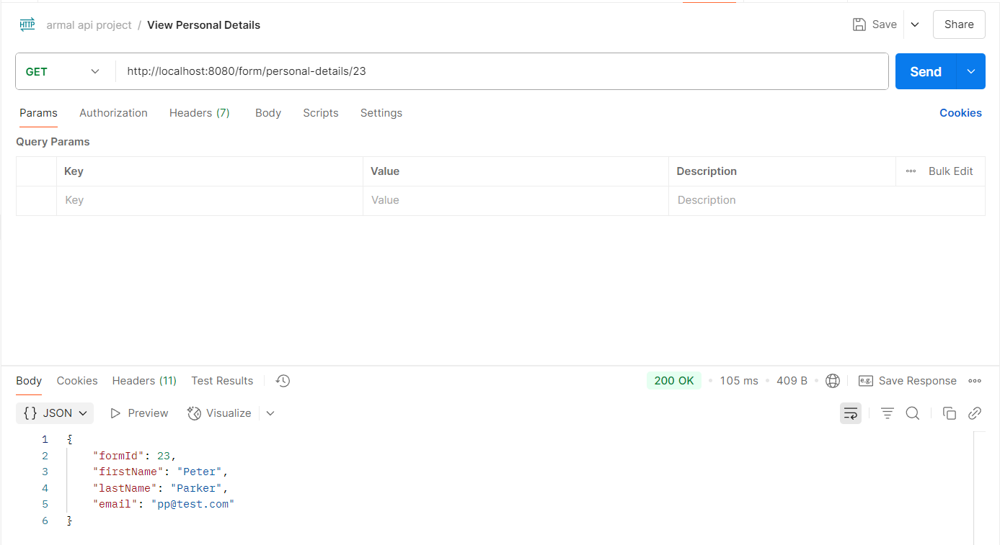


## Submitting Address
To associate and address to the form you will need to send a POST request along with a JSON payload
of the address you would like to save. Please note you will need to provide the form id
retrieved when you initially created the form.

```text
http://localhost:8080/form/save/address
```
The server will produce a response status of 201 Created and provide a URI in the response headers 'Location' property. 
You can use this URI to make a GET request for the address resource we saved.
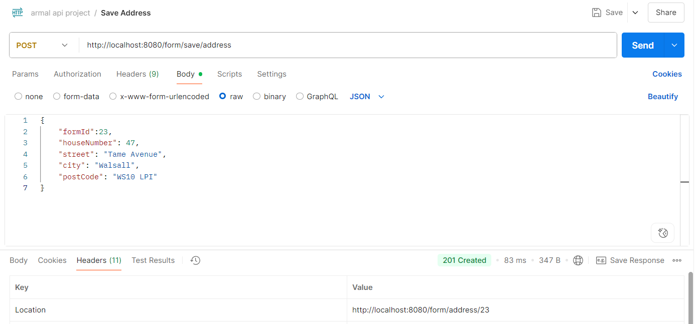

## Viewing the Address
Using the returned URI from the previous response we are able to submit a GET request to view the resource. The server will return a
response status 200 OK and a JSON payload containing the personal details of the form
```text
http://localhost:8080/form/address/23
```
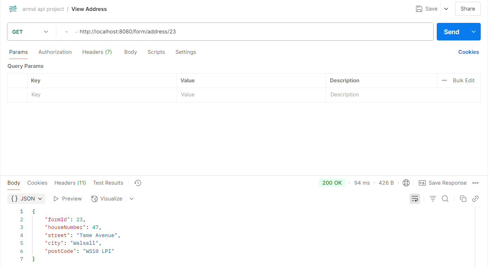

## Viewing a Form
You can view a form to retrieve all of its associated data and to see if the form has been finalized.
```text
http://localhost:8080/form/view/23
```

The server will produce a response status of 200 OK and provide a JSON payload of the whole form including a
boolean property 'finalized'
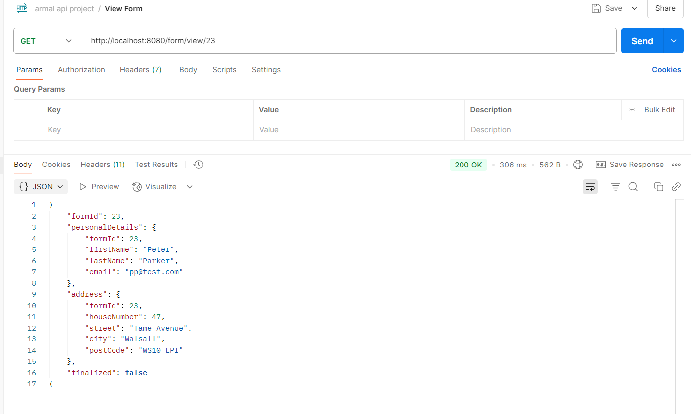

## Submitting a completed application form
To submit the full form which is not currently finalized you will need to send a POST request to the server 
using the application id retrieved when initially creating the form.

```text
http://localhost:8080/form/submit/23
```

The server will produce a response status of 200 OK and a body containing the text "Form submitted"
boolean property 'finalized'
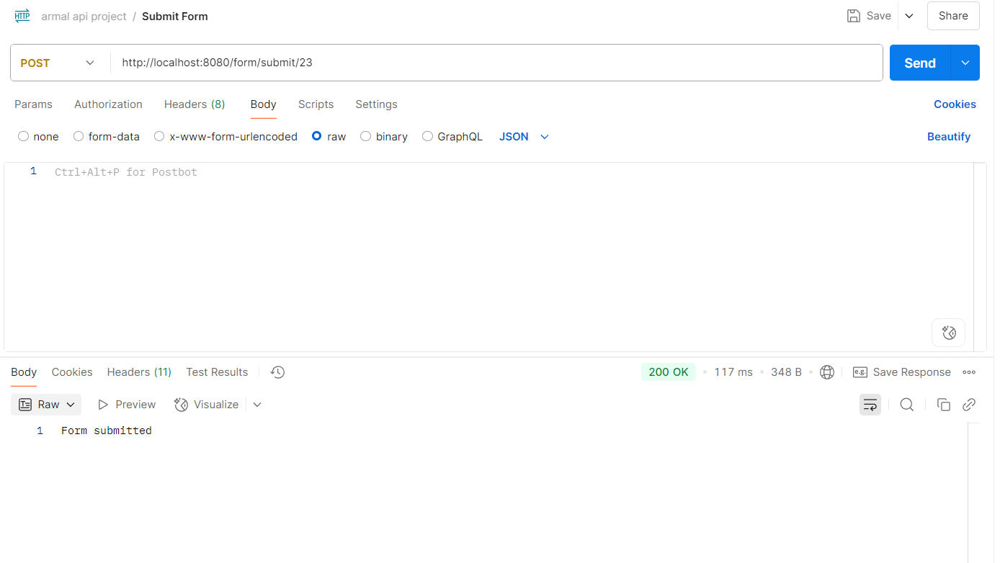

## Viewing the form again to check its finalized
We are now going the view the form again after submitting it, just to ensure that it has been
finalized.

```text
http://localhost:8080/form/view/23
```
As you can see the property "finalized" is now set to true
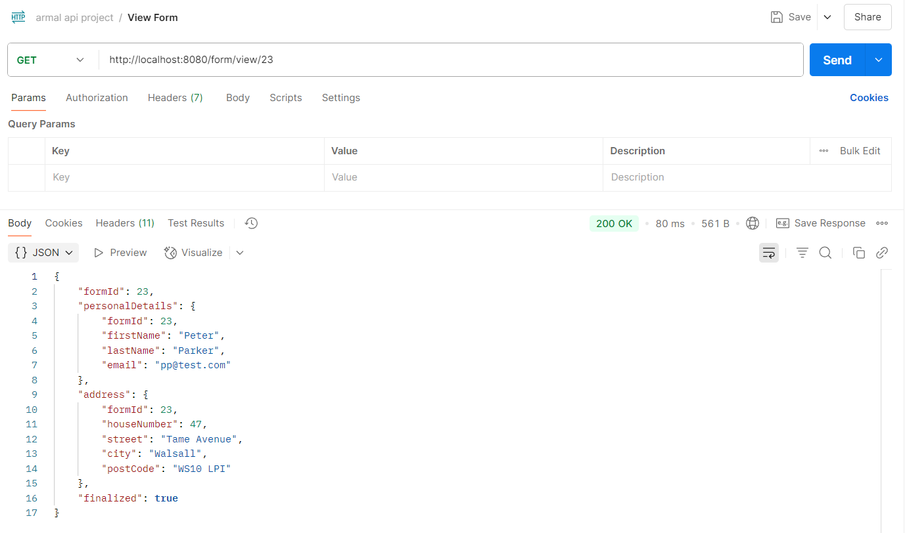

## Validation errors example
If the API encounters a validation error when trying to bind the provided JSON Paylaod will receive an
response from the servers with a status code 400 Bad Request and message indicated the validation error

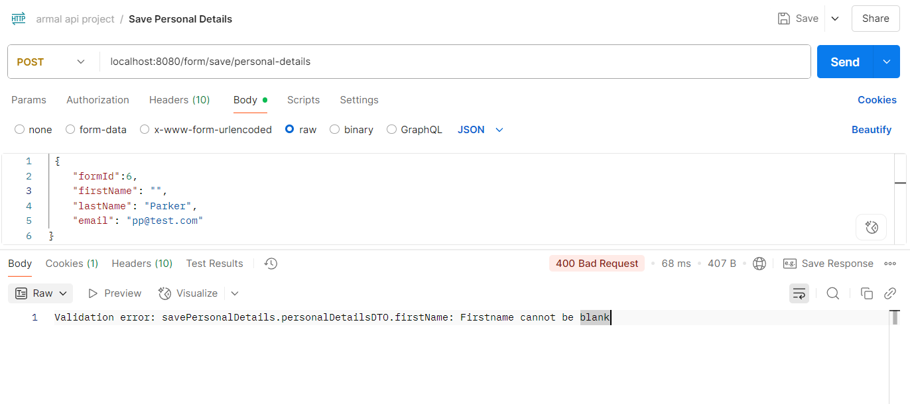

## API errors
If the API encounters an error for example when you are trying to access a address that is not not yours 
you will receive a response from the server with a relevant status code.

### Accessing another users application
example trying to access an application that does not match your current session id, server responds
with status 403 Forbidden and a message body of "No access"
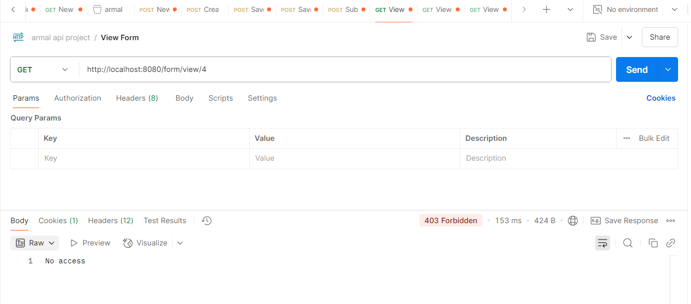

### Trying to save out of sequence 
Here we are trying to save Address before personal details have been entered
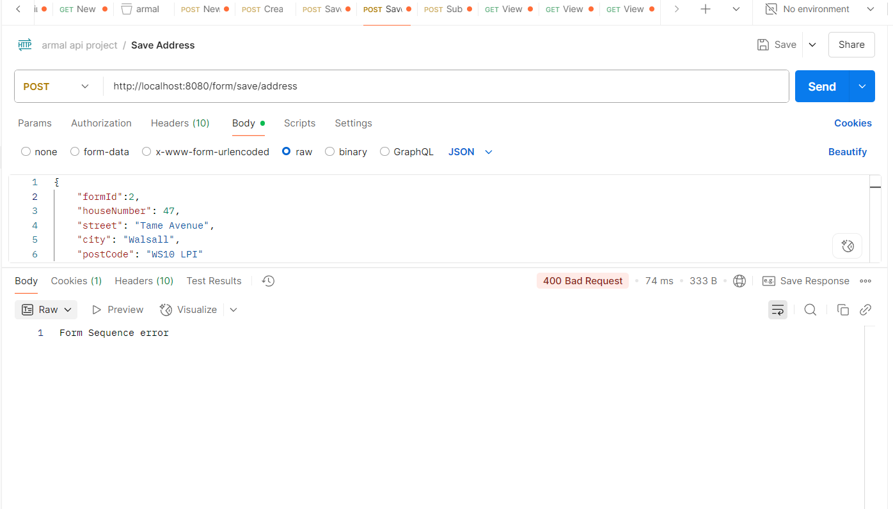

### Trying to submit an incomplete form
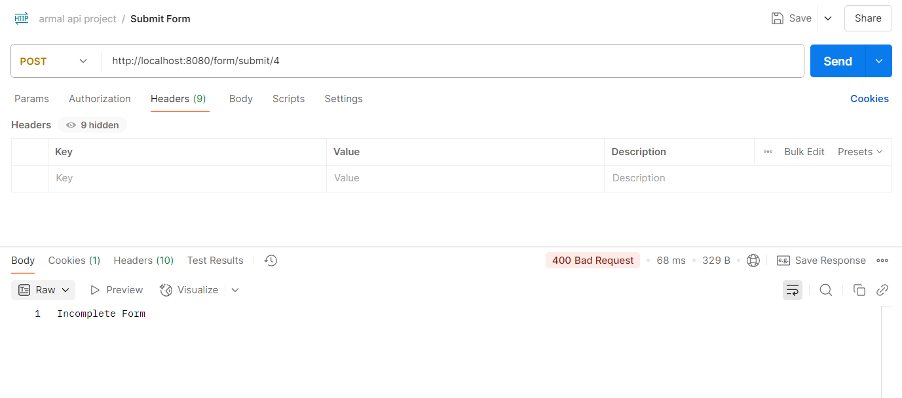

## Trying to access or save data for a none existent form
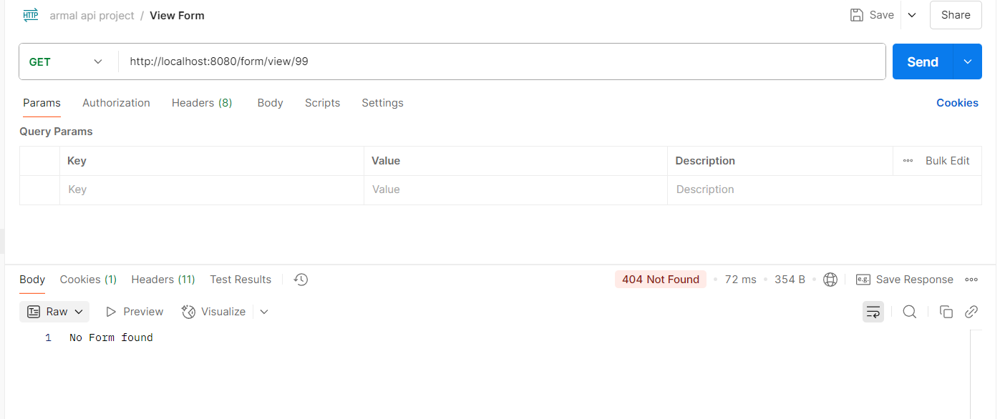

## Trying to modify a finalized form
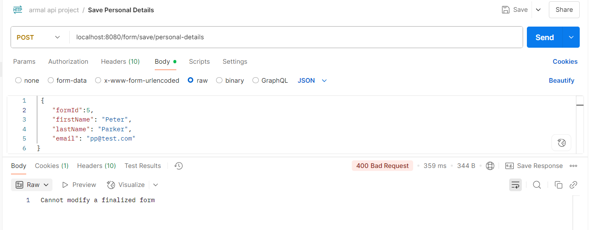


## Postman 
I have included an export of the endpoints used in this read me within the postman folder of this project. 
You can import this file into postman to use the API.

## Clean up docker databases
Run the following command to remove the docker postgres databases that were created
```bash
docker-compose down
```
